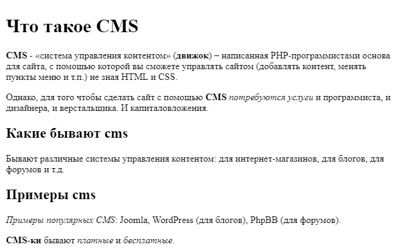
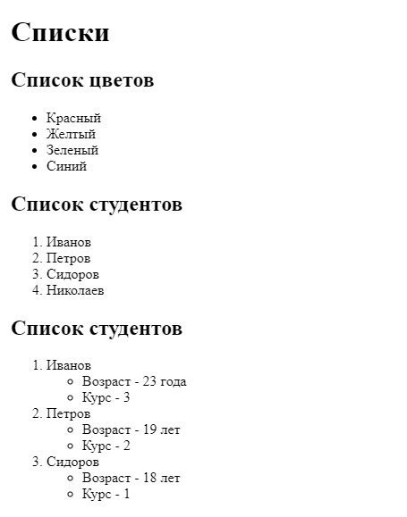
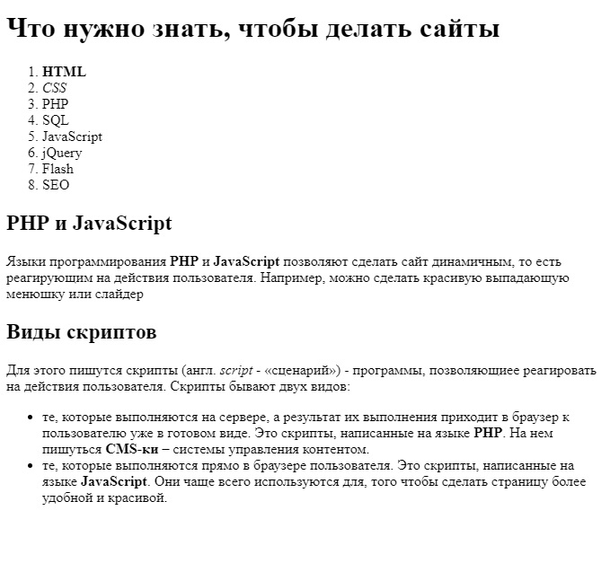

    Задачи для решения
 
**На заголовки, жирность, курсив**

1. Повторите страницу по данному образцу:

    
    
       страница 1

2. Повторите страницу по данному образцу:

    
    
       страница 2

**На списки**

1. Повторите страницу по данному образцу:

    
    
       страница 3

**На заголовки, абзацы и списки**

1. Повторите страницу по данному образцу:

    
    
       страница 4
 
**Связанные ссылками страницы**

1. Повторите 3 страницы и свяжите их ссылками друг с другом: [Страница 2](img/2.jpg), [Страница 3](img/3.jpg), [Страница 4](img/4.jpg).

**На картинки**

1. Повторите страницу по данному образцу:

    
    
       страница 4

[Далее](https://github.com/KinShish/learning_task_1/tree/master/2)       