    Задачи для решения

**На селекторы со ссылками**
 
1. Повторите страницу по данному по образцу.
        
       Второй вариант при наведенном, на ссылку, указателе мышки.

   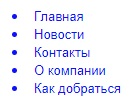 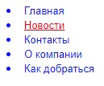
   
       шрифт: 13px Arial;
       цвет шрифта: blue;
       цвет при наведении: red;
   
2. Повторите страницу по данному по образцу.
   
       Второй вариант при наведенном, на ссылку, указателе мышки.
   
   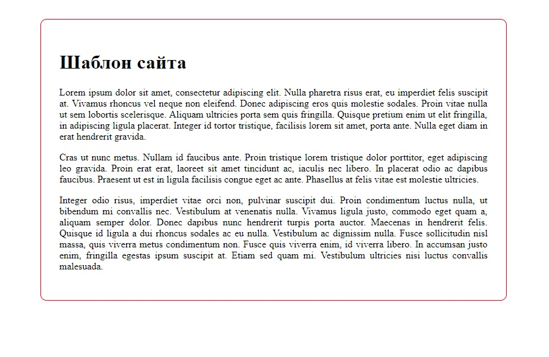 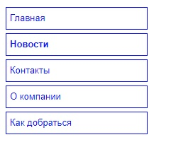
   
       цвет шрифта: blue;
       шрифт: 13px Arial;
       шрифт при наведении жирный;
       граница: 1px solid blue;
       внутренний отступ: 0px 5px;
       внутренний отступ списка: 5px;
       высота строки: 30px;
       
3. Повторите страницу по данному по образцу.

       Второй вариант при наведенном, на ссылку, указателе мышки. 
   
   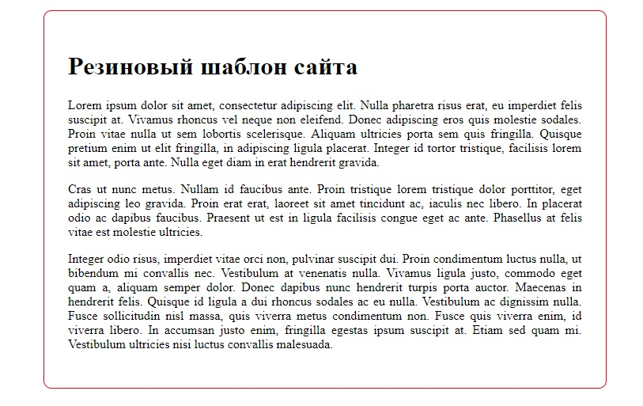 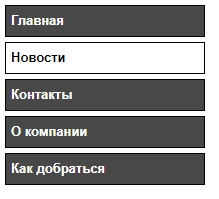
        
       цвет шрифта: white;
       шрифт: 13px Arial;
       граница: 1px solid black;
       внутренний отступ: 0px 5px;
       внутренний отступ списка: 5px;
       высота строки: 30px;
       цвет фона: #484848;
       ширина шрифта: bold;
       при наведении цвет шрифта и фона меняются местами
           
4. Повторите страницу по данному по образцу.

       Второй вариант при наведенном, на ссылку, указателе мышки.
       
   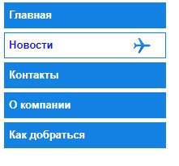 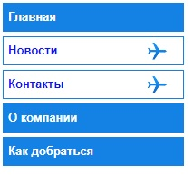

        цвет шрифта: white;
        шрифт: 13px Arial;
        граница: 1px solid #0081E7;
        внутренний отступ: 0px 5px;
        внутренний отступ списка: 5px;
        высота строки: 30px;
        цвет фона: #0081E7;
        ширина шрифта: bold;
        при наведении:
          цвет шрифта на blue
          цвет фона меняются на #fff и в фон добавляется изображение
        Кнопка Новости активная  

5. Повторите страницу по данному по образцу.

        Второй вариант при наведенном, на ссылку, указателе мышки.
    
   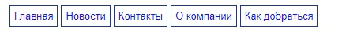 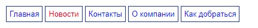    

        цвет шрифта: blue;
        шрифт: 13px Arial;
        граница: 1px solid #1A31A2;
        внутренний отступ: 5px;
        при наведении:
          цвет шрифта на red  

6. Повторите страницу по данному по образцу.

        Второй вариант при наведенном, на ссылку, указателе мышки.
    
   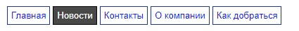 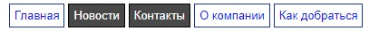    
          
        цвет шрифта: blue;
        шрифт: 13px Arial;
        граница: 1px solid #1A31A2;
        внутренний отступ: 5px;
        при наведении:
          цвет шрифта на #fff
          цвет фона меняется на #484848
          цвет границы меняется на black
        Кнопка Новости активная  

7. Повторите страницу по данному по образцу.

        Второй вариант при наведенном, на ссылку, указателе мышки.
    
   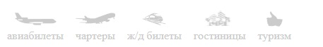 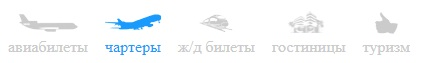    
          
        Отступ с права у списка: 13px;
        цвет шрифта:#CBCBCB;
        внутренний отступ с верху: 30px;
        отступ для иконки
        при наведении:
          цвет шрифта на #039CFF
           
8. Повторите страницу по данному по образцу.

        Второй вариант при наведенном, на ссылку, указателе мышки.
    
   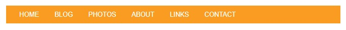 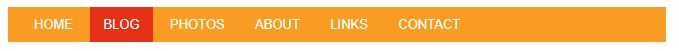    
          
        цвет шрифта: #FFFFFF;
        Внутренний отступ: 0px 13px;
        высота шрифта: 35px;
        шрифт: 13px;
        Отступ с лева у списка: 13px;
        фон всего меню: #FC9D00;
        ширина меню: 100%;
        при наведении:
          цвет фона: #E93301;

9. Повторите страницу по данному по образцу.

        Второй вариант при наведенном, на ссылку, указателе мышки.
        При наведении появляется подчеркивание
    
    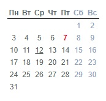    
          
        Ширина всего календаря: 150px;
        Внешний отступ календаря: 20px 0px;
        
        Календарь это таблица, где дни недели это заголовок страницы        
        цвет шрифта заголовка: #506361;
        цвет шрифта дней: #506361;
        цвет шрифта выходных: #8CA2C1;
        цвет праздничного дня: red;
        шрифт: 12px Arial;
        
          
**Все необходимые изображения**

   
    
       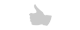
   
       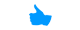                   
   
[Назад](https://github.com/KinShish/learning_task_1/tree/master/9)