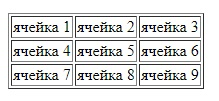
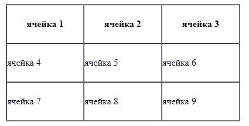
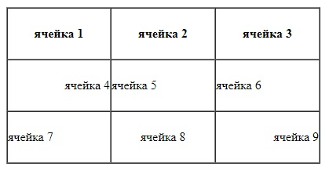
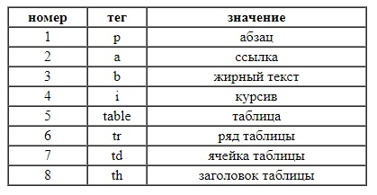

    Задачи для решения

**Группировка столбцов и рядов**

1. Повторите страницу по данному образцу:

    
    
2. Повторите страницу по данному образцу:

    
    
3. Повторите страницу по данному образцу:

    
    
**Закрепление**

1. Повторите страницу по данному образцу:

    
    
[Назад](https://github.com/KinShish/learning_task_1/tree/master/2) ... [Далее](https://github.com/KinShish/learning_task_1/tree/master/4)    