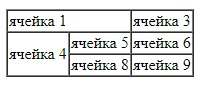
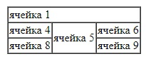
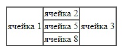
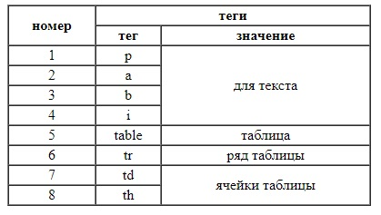

    Задачи для решения

**Простые таблицы**

1. Повторите страницу по данному образцу:

    
    
**Добавим заголовки, атрибуты width (400) и height (200)**

2. Повторите страницу по данному образцу:

    
    
**Добавим выравнивание align**

1. Повторите страницу по данному образцу:

    
    
**Закрепление**

1. Повторите страницу по данному образцу:

    
    
[Назад](https://github.com/KinShish/learning_task_2/tree/master/1) ... [Далее](https://github.com/KinShish/learning_task_1/tree/master/4)    