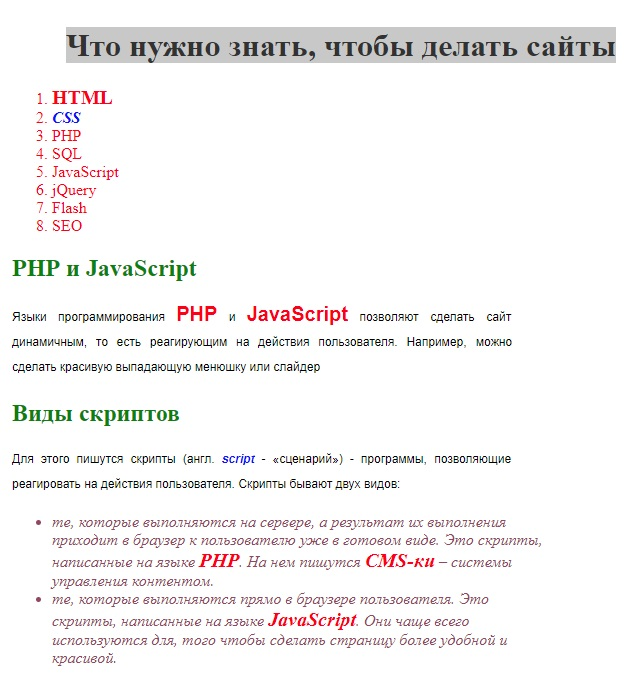

    Задачи для решения
    
Все изменения проводить над текстом из [предыдущего задания](https://github.com/KinShish/learning_task_1/tree/master/4)

**На цвета**

    Для решения задач данного блока вам понадобятся следующие CSS свойства: color.
 
1. Сделайте все абзацы \
 красного цвета.

2. Сделайте все \<h1> зеленого цвета.

3. Сделайте все \<h2> голубого цвета.

4. Сделайте все \<h3> оранжевого цвета.

**На style**

    Для решения задач данного блока вам понадобятся следующие HTML атрибуты: style.
 
1. Сделайте первый на странице абзац \
 зеленого цвета.

2. Сделайте второй на странице абзац \
 красного цвета.

**На ширину и высоту**

    Для решения задач данного блока вам понадобятся следующие CSS свойства: width, height.

1. Сделайте все абзацы \<h2> шириной 300px.

2. Сделайте все таблицы \<table> шириной 400px, высотой 200px.

**На выравнивание**

    Для решения задач данного блока вам понадобятся следующие CSS свойства: text-align.
 
1. Поставьте все \<h1> по центру.

2. Поставьте все \<h2> по правому краю.

3. Сделайте так, чтобы текст в абзацах \
 был выровнен одновременно и по правому и по левому краю.

4. Сделайте так, чтобы во втором абзаце \
 текст был выровнен по центру.

5. Поставьте все \<th> по левому краю.

6. Поставьте все \<td> по центру.

**На жирность**

    Для решения задач данного блока вам понадобятся следующие CSS свойства: font-weight.
 
1. Сделайте все \<td> жирным.

2. Сделайте \<h1> нежирным.

3. Сделайте одновременно \<th>, \<h1> и \<h2> нежирным.

**На курсив**

    Для решения задач данного блока вам понадобятся следующие CSS свойства: font-style.
 
1. Сделайте все \<h2> курсивом.

2. Сделайте все абзацы \
 курсивом, а первый абзац - нет.

**На размер шрифта**

    Для решения задач данного блока вам понадобятся следующие CSS свойства: font-size.
1. Сделайте все \<h2> 20px.

2. Сделайте все абзацы \
 15px.

**На семейство**

    Для решения задач данного блока вам понадобятся следующие CSS свойства: font-family.
 
1. Сделайте для абзацев \
 шрифт Arial.

2. Сделайте для \<h2> шрифт Times New Roman.

3. Сделайте для \<h3> любой шрифт без засечек.

**На межстрочный интервал**

    Для решения задач данного блока вам понадобятся следующие CSS свойства: line-height.
 
1. Сделайте межстрочный интервал для абзацев \
 в 30px.

**На свойство-сокращение font**

    Для решения задач данного блока вам понадобятся следующие CSS свойства: font.
 
1. Закомментируйте все стили для абзацев.

2. Для \
 сделайте шрифт Arial, 16 пикселей, курсив, жирный, межстрочный интервал в 30px.

3. Для \<h1> сделайте следующий шрифт: нежирный, 20 пикселей, Verdana.

**На красную строку**

    Для решения задач данного блока вам понадобятся следующие CSS свойства: text-indent.

1. Сделайте красную строку в абзацах 30px.

2. Для второго абзаца \
 уберите красную строку.

**На вертикальное выравнивание**

    Для решения задач данного блока вам понадобятся следующие CSS свойства: vertical-align.
 
1. Поставьте текст в таблице \<table> по верхнему краю по вертикали.

2. Поставьте текст в \<th> по центру по вертикали.

**Повторите страницы по образцу**
 
1. Повторите страницу по данному по образцу:

   

2. Повторите страницу по данному по образцу:

           
   
[Назад](https://github.com/KinShish/learning_task_1/tree/master/4) ... [Далее](https://github.com/KinShish/learning_task_1/tree/master/6)