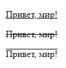
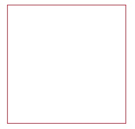
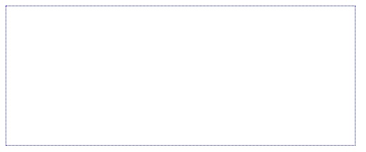
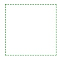
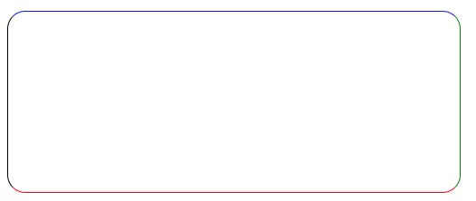
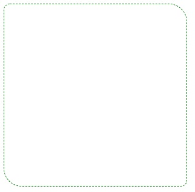
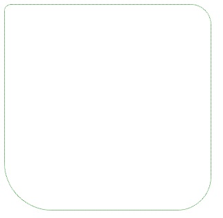
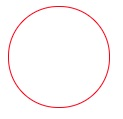
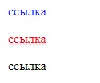

    Задачи для решения

**На селекторы со ссылками**
 
1. Сделайте селектор, который выберет все ссылки из id=test, с состояния link и visited сделайте неподчеркнутыми и красными, а состояние hover - подчеркнутым и голубым.
   
2. Сделайте селектор, который выберет все ссылки с классом www, состояния link и visited сделайте подчеркнутыми и голубыми, а состояние hover - неподчеркнутым.
   
3. Сделайте селектор, который выберет все ссылки из id=test с классом www. Цвета состояний выберите самостоятельно.
   
4. Сделайте селектор, который выберет все ссылки из class=eee с классом www. Цвета состояний выберите самостоятельно.

**На text-decoration**

    Для решения задач данного блока вам понадобятся следующие CSS свойства: text-decoration.
    
1. Повторите страницу по данному по образцу:
    
   

**На границы**

    Для решения задач данного блока вам понадобятся следующие CSS свойства: border-style, border-width, border-color, border, border-radius.
    
1. Повторите страницу по данному по образцу:
    
   
    
2. Повторите страницу по данному по образцу:
    
       
    
3. Повторите страницу по данному по образцу:
    
   

4. Повторите страницу по данному по образцу:
    
   

5. Повторите страницу по данному по образцу:
    
   

6. Повторите страницу по данному по образцу:
    
   

7. Повторите страницу по данному по образцу:
    
       

**На ссылки**
    
1. Повторите страницу по данному по образцу:
    
           

   
[Назад](https://github.com/KinShish/learning_task_1/tree/master/4) ... [Далее](https://github.com/KinShish/learning_task_1/tree/master/6)