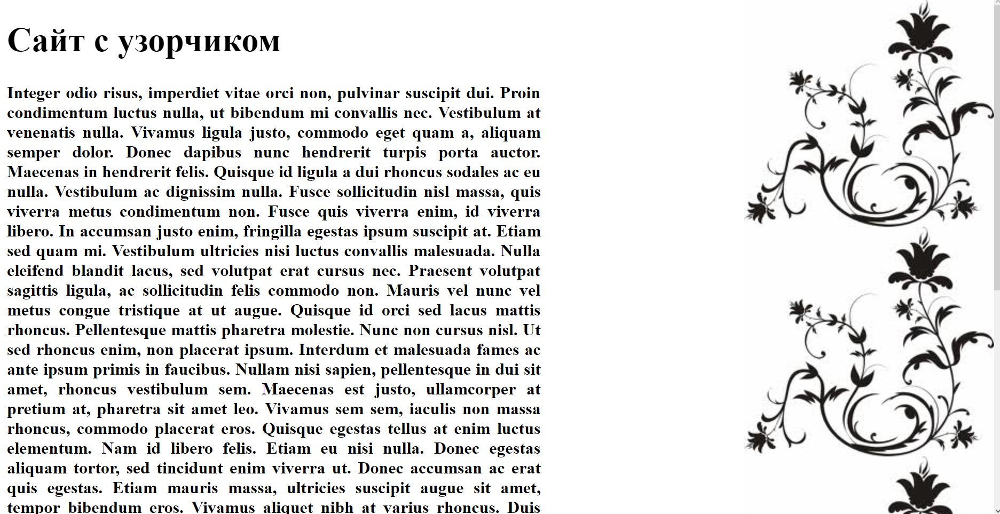
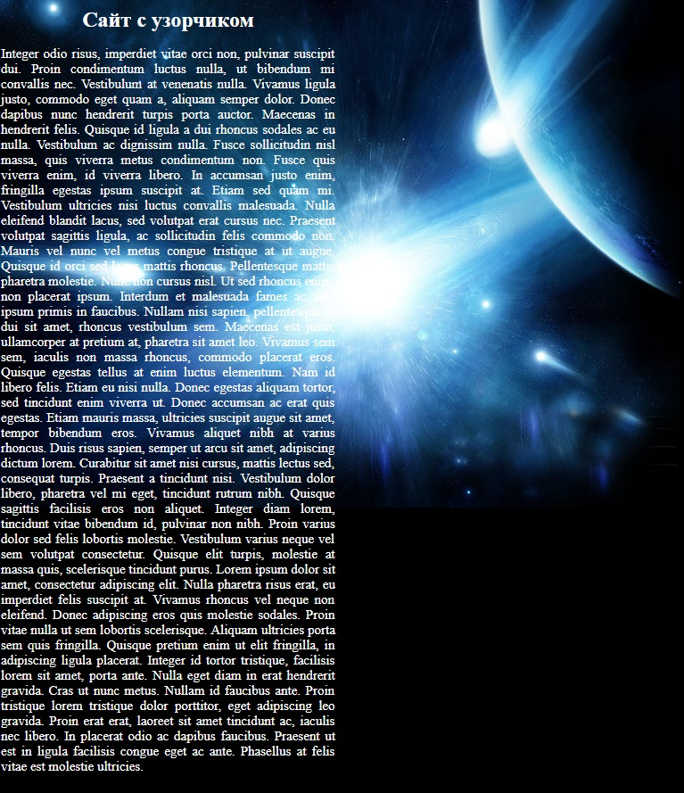
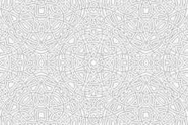

    Задачи для решения

**На селекторы со ссылками**
 
1. Повторите страницу по данному по образцу.

   
   
2. Повторите страницу по данному по образцу.
   
   
   
3. Повторите страницу по данному по образцу.
   
   
   
4. Повторите страницу по данному по образцу.

   
   
**Все необходимые изображения**       

        
   
[Назад](https://github.com/KinShish/learning_task_1/tree/master/7) ... [Далее](https://github.com/KinShish/learning_task_1/tree/master/9)