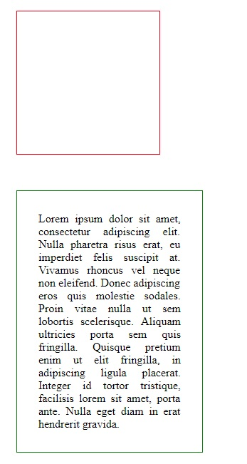
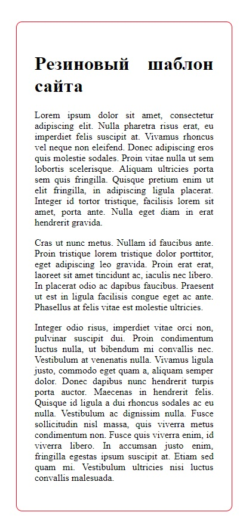
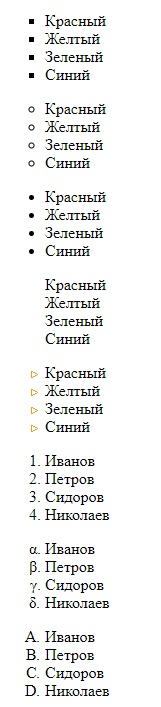

    Задачи для решения

**На селекторы со ссылками**
 
1. Повторите страницу по данному по образцу.

   
   
2. Повторите страницу по данному по образцу.
   
   
   
       ширина: 700px;
       внешний отступ: 50px auto;
       внутренний отступ: 30px;
       граница: 1px solid red;
       радиус границ: 10px;
       
3. Повторите страницу по данному по образцу.

        Необходимо чтобы при изменении ширины страницы в браузере, изменялся и сам div. 
   
    
        
        ширина: пол экрана;
        минимальная ширина: 300px;
        максимальная ширина: 650px;
        расположение по середине;
        внутренний отступ: 30px;
        граница: 1px solid red;
        радиус границ: 10px;
           
4. Повторите страницу по данному по образцу.
    
    

5. Повторите страницу по данному по образцу.
    
        
   
   
**Все необходимые изображения**

       
   
[Назад](https://github.com/KinShish/learning_task_1/tree/master/8) ... [Далее](https://github.com/KinShish/learning_task_1/tree/master/10)