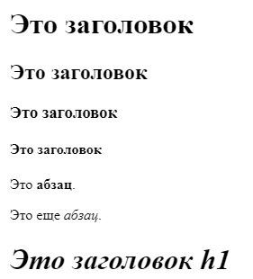
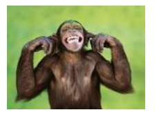

    Задачи для решения
 
**На заголовки, жирность, курсив**

1. Повторите страницу по данному по образцу:

    

2. Повторите страницу по данному по образцу:

    
    
       страница 1

**На списки**

1. Повторите страницу по данному по образцу:

    
    
       страница 2

**На заголовки, абзацы и списки**

1. Повторите страницу по данному по образцу:

    
    
       страница 3
 
**Связанные ссылками страницы**

1. Повторите 3 страницы и свяжите их ссылками друг с другом: [Страница 1](img/2.jpg), [Страница 2](img/3.jpg), [Страница 3](img/4.jpg).

**На картинки**

1. Повторите страницу по данному по образцу:

    
    
       страница 4